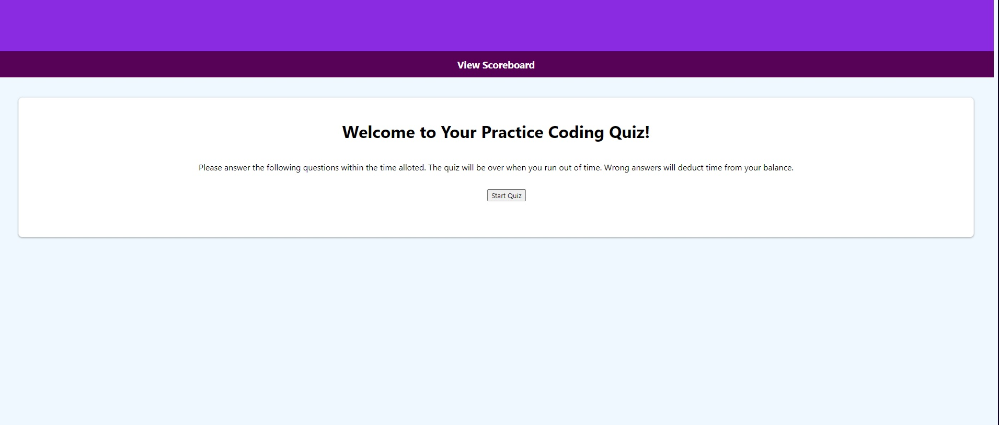

# Code Quiz

## Description

My motivation for doing this project was to learn how to use Web APIs to create elements and styling in an HTML file. This coding quiz also allows me to check my own understanding of coding concepts through an interactive quiz.

This quiz can help entry level coders study while also adding a competitive element through the high score board.

Through this project I have learned how to use DOM as well as how to utilize event listeners and functions. This project is incomplete, and I will need to go back to add additional functionality to meet the acceptance criteria for this project.

## Usage

This weboage can be used to take a quiz when it is completed to test your basic coding knowledge.

## Credits

N/A

## License

See repository for applicable license.